# Report generator using akasha
- [Report generator using akasha](#report-generator-using-akasha)
  - [Environment Building](#environment-building)
  - [Postgres Database Setup](#postgres-database-setup)
    - [Session ID Database](#session-id-database)
    - [Username/Password Database](#usernamepassword-database)
  - [API Server Setup](#api-server-setup)
    - [Session ID API](#session-id-api)
    - [Username/Password API](#usernamepassword-api)
  - [WebUI Setup](#webui-setup)
    - [Session ID UI](#session-id-ui)
    - [Username/Password UI](#usernamepassword-ui)
  - [Docker Compose Setup](#docker-compose-setup)
    - [Prerequisites](#prerequisites)
    - [Usage](#usage)
    - [Container Details](#container-details)


## Environment Building

I personally used the `conda` package manager to create a new environment.
You can create a new environment with the following command.

```bash
conda create -n python3_9 python=3.9
```
> [!NOTE]
> I recommend using Python 3.9 to avoid any compatibility issues.

<br/>

Then, activate the environment and install the required packages.

```bash
conda activate python3_9
pip install -r requirements.txt
```

<br/>
<br/>

## Postgres Database Setup
In this project, I used a Postgres database to store the generated reports. There are two types of database. One is for session id authentication and the other is for username/password authentication.

<br/>

### Session ID Database
The session id database is used to store the generated report. Run the following command to create a new database.

```bash
bash ./scripts/create_db.sh
```

### Username/Password Database
The username/password database is used to store the user's information and the generated report. Run the following command to create a new database.

```bash
bash ./scripts/create_db_auth.sh
```

> [!IMPORTANT]
> `DB_NAME`, `DB_USER`, `DB_PASSWORD` are originally set to `reportdb`, `reportuser`, `reportpassword` respectively. Remember to change these values in the `create_db.sh` file if you want to use different values.

<br/>

## API Server Setup

### Session ID API
To start the API server for the session id database, run the following command.

```bash
python ./reportGenerator/api_tool.py
```

### Username/Password API
To start the API server for the username/password database, run the following command.

```bash
python ./reportGenerator/api_auth.py
```

<br/>

## WebUI Setup

### Session ID UI
To start the WebUI for session id api, run the following command.

```bash
streamlit run ./reportGenerator/ui.py
```

This is the main page of the WebUI for the session id api.

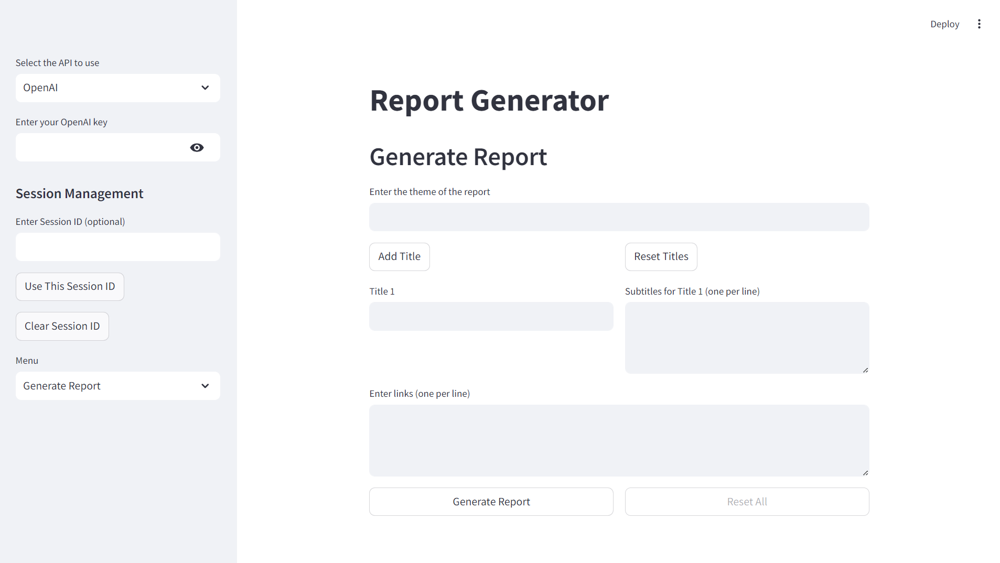

<br/>

First, you need to choose which API to use and fill in the required fields.

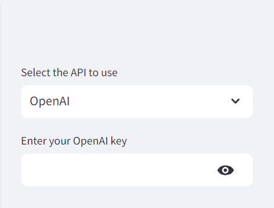

<br/>

After filling in the required fields, if you have your own session id, you can use it and press `Use This Session ID`. Otherwise, just skip it.

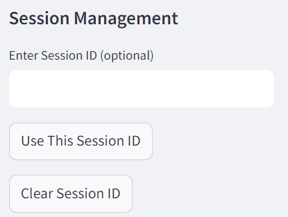

<br/>

Then, choose which function to use.(`Generate Report`, `Get Report`, `Reprocess Report`, `Delete Session`)

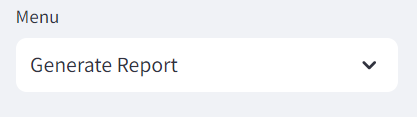

<br/>
<br/>

**Generate Report**

Fill in the theme and titles of the report and the links to the data you want to use. Then press the `Generate Report` button to generate the report. It may take a few minutes to generate the report.

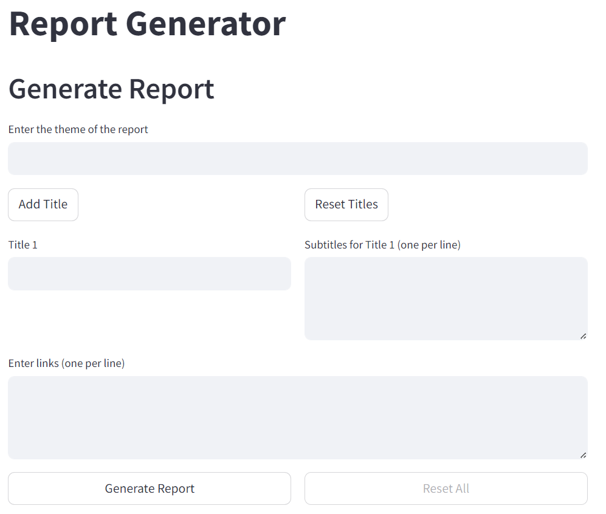

After generating the report, the web page will automatically save your session id. So, you don't need to fill in the session id every time you generate a report.

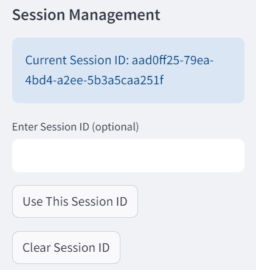

<br/>

**Get Report**

After generating the report, you can take a look at the generated report by clicking the `Get Report` button.

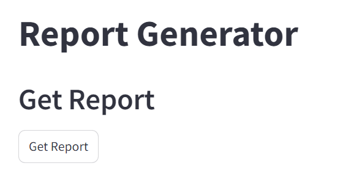

**Reprocess Report**

If you want to modify the generated report, you can fill in your needs and press the `Reprocess Report` button.

> [!IMPORTANT]
> When you fill in your needs, be sure you only demand one part of the report.

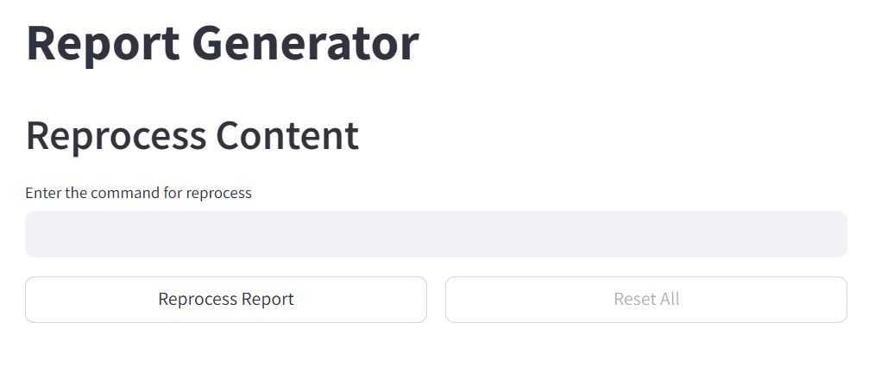

**Delete Session**

When you don't need the session anymore, you can delete the session by clicking the `Delete Session` button. By doing this, the generated report stored in the database will be deleted.

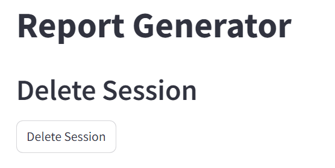

<br/>

### Username/Password UI
To start the WebUI for username/password api, run the following command.

```bash
streamlit run ./reportGenerator/ui_auth.py
```

The most of the UI is the same as the session id UI. The only difference are the login page and the register page.

If you don't have an account, you can register by clicking the `Register` button.

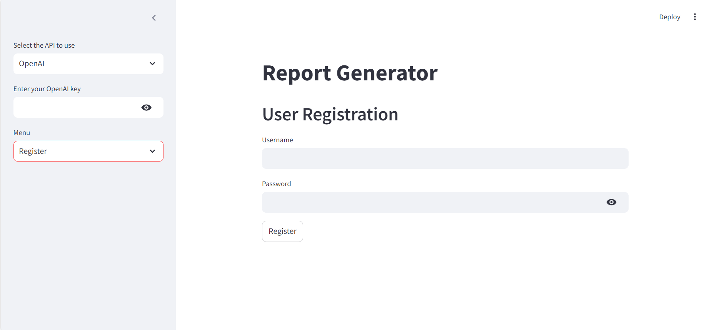

After registering, you can login with your username and password.

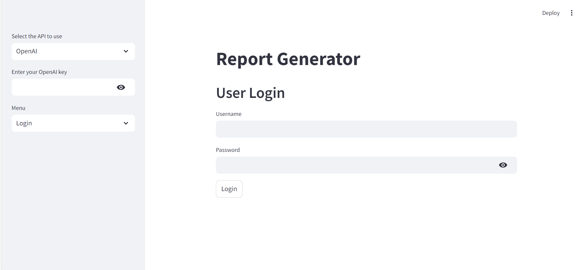

<br/>

## Docker Compose Setup
To simplify the setup process and ensure consistency across different environments, you can use Docker Compose to run the entire application stack. This will start three Docker containers: API, DB, and UI, and map them to specific local ports.

### Prerequisites
`Docker` and `Docker Compose` installed on your system

### Usage
Navigate to the project root directory where the `docker-compose.yml` file is located.

Run the following command to start all services:
```bash
docker-compose up -d
```

This command will build (if necessary) and start the containers in detached mode.

The services will be available at the following local ports:

- API: `http://localhost:8001`
- Database: `Port 5433`
- UI: `http://localhost:8502`


To stop the services, run:

```bash
Copydocker-compose down
```

### Container Details

**API Container:**

- Service name: `api`
- Exposes the API server on port 8001
- Built from the Dockerfile in the project


**Database Container:**

- Service name: `db`
- Runs PostgreSQL
- Exposes the database on port 5433


**UI Container:**

- Service name: `ui`
- Runs the Streamlit web interface
- Accessible on port 8502


> [!NOTE]
> - Make sure no other services are running on ports 8001, 5433, or 8502 on your local machine to avoid conflicts.
> - The Docker Compose setup uses environment variables defined in the docker-compose.yml file. Ensure these match your configuration needs.
> - For production deployments, consider using secrets management for sensitive information like database credentials.